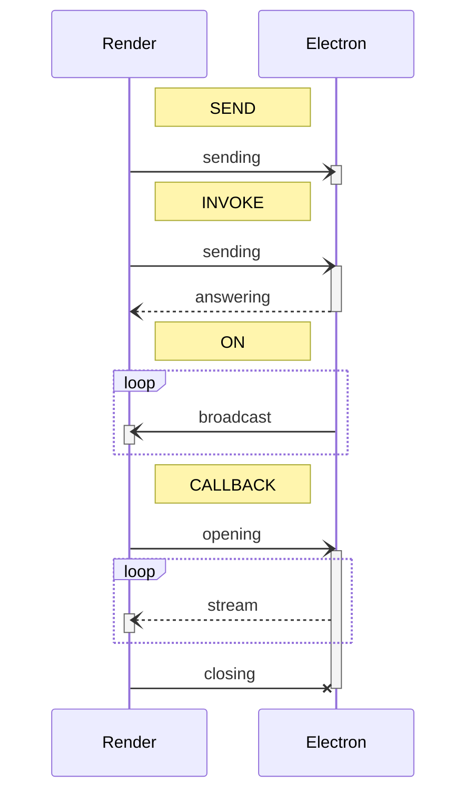
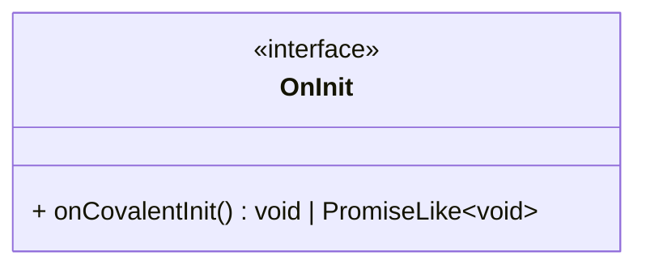

# Introduction

Covalent is a TypeScript library which encapsulates and facilitates inter-process communications between an Electron
backend and its frontends.
This library was thought for Angular render processes, but it can be used for other project types.

In Covalent, Electron is the master: the backend exposes its features to the render processes, the _controller_ classes
expose their functions.
On the render side, each controller is associated with one (or several) _proxy_ class to provide the controllers'
features to the front.
Controllers and their proxies share a _bridge_ interface that defines the functions exposed by controllers.

## Communication types

Covalent manages four types of inter-process communication:

- `SEND` : Sending data from a render process to the core process.
- `INVOKE` : Sending data from a render process to the core process and waiting for its answer.
- `ON` : Sending data from the core process to all the render processes.
- `CALLBACK` : Sending data from a render process to the core process and reading a stream.

Here are the corresponding sequence diagrams:



Since it is inter-process communication, all calls are asynchronous.

## Exemples

In the following sections, the following interfaces will be used in the example codes:

```typescript
import { Bridge } from "@covalent/types";

export type ClickEvent = { buttons: number; x: number; y: number; ctrl: boolean };

// descriptions from the render process point of view

export interface ExampleBridge {
    doAction: Bridge.Send<string>; // sending a string
    getConfig: Bridge.Invoke<void, { url: string }>; // asking an object
    calculate: Bridge.Invoke<{ x: number }, number>; // sending an object and waiting for a number
    onDate: Bridge.On<Date>; // watching dates
    onClick: Bridge.On<ClickEvent>; // watching click events
    watchMetrics: Bridge.Callback<{ period: number }, { percentCpuUsage: number }>; // sending a period and watching stats
}
```

# Electron-side usage

## Installation

To install Covalent in your Electron project, run the following command:

```shell
npm i @covalent/core
```

## Definition

To define a controller, just add the `Controller` decorator on a class.

```typescript
import { interval, map, Subject } from 'rxjs';
import { BridgeType, CallbackSubject, Controller } from "@covalent/core";

@Controller<ExampleController, ExampleBridge>({
    group: "example",
    bridge: {
        doAction: BridgeType.SEND,
        getConfig: BridgeType.INVOKE,
        calculate: BridgeType.INVOKE,
        onDate: BridgeType.ON,
        onClick: BridgeType.ON,
        watchMetrics: BridgeType.CALLBACK,
    },
    handlers: (self) => ({
        doAction: self.doAction,
        getConfig: () => self.config,
        calculate: self.calculate,
        watchMetrics: self.startWatchingMetrics,
    }),
    triggers: (self) => ({
        onDate: interval(200).pipe(map(() => new Date())),
        onClick: self.clickSubject.asObservable(),
    })
})
export class ExampleController {
    constructor(private readonly anotherController: AnotherController, ...) {
    }

    private clickSubject = new Subject<ClickEvent>();

    private doAction(action: string) { ...
    }

    public get config(): { url: string } { ...
    }

    private calculate(params: { x: number }): number { ...
    }

    public startWatchingMetrics(subject: CallbackSubject<{ percentCpuUsage: number }>, input: { period: number }) { ...
    }
}
```

- `group` is the unique ID of the controller.
- `bridge` identifies each endpoint type.
  Despite the fact that it is redundant with the bridge definition, this step can't be automatized because of the
  language limitations.
- `handlers` defines the methods to execute for each `SEND`, `INVOKE` and `CALLBACK` endpoints.
- `triggers` defines the RxJS observables that will trigger sending a message on `ON` endpoints.

`handlers` and `triggers` are functions with the controller instance as its parameter (controller private members are
reachable).

A controller class can define a constructor, but its arguments must be only other controllers.
Their instances will be injected automatically.

## Registering

In the Electron launching script, it is required to call the `Controllers.register` method with all the controllers as
its parameters:

```typescript
Controllers.register(..., ExampleController, ...);
```

This method instantiates the controllers.
The parameters order doesn't matter, since the method takes into account the dependency injections.
If there are controllers that implement the `OnInit` interface, this method will also call their `onCovalentInit`
method.



The `OnInit` interface allows controllers to have an asynchronous initialization part (since constructors are always
synchronous).
Be careful with dependencies between controllers with the `onCovalentInit`: `onCovalentInit` methods are called in
parallel, a controller can be not fully initialized when used inside it.
In this case, use the `Controllers.waitInit` method to assert controllers initialization.

## Exposition

In the preload script, it is required to call the method `Controllers.exposeBridge` with all the controllers as its
parameters:

```typescript
Controllers.exposeBridge(..., ExampleController, ...);
```

# Render-side usage

## Installation

To install Covalent in your frontend project, run the following command:

```shell
npm i @covalent/render
```

## Definition

To define a proxy, just add the `Proxy` decorator on an Angular service (or a simple class if it is not an Angular
project).

```typescript
import { EMPTY, interval, map } from 'rxjs';
import { BridgeOf, BridgeOpen, Bridges, Proxy } from "@covalent/render";

@Injectable() // Angular services decorator.
@Proxy<ExampleProxy, ExampleBridge>({
    group: 'example',
    mirror: ['doAction', 'calculate'],
    map: (bridge) => ({
        getConfiguration: bridge.getConfig, // or Bridges.cache(bridge.getConfig) for optimization
        date$: Bridges.of(bridge.onDate),
        click$: Bridges.of(bridge.onClick),
        watch: Bridges.open(bridge, 'watchMetrics'),
    }),
})
export class ExampleProxy {
    public readonly doAction: ExampleBridge['doAction']
        = Bridges.Default.Send();
    public readonly getConfiguration: ExampleBridge['getConfig']
        = Bridges.Default.Invoke({ url: "/" });
    public readonly calculate: ExampleBridge['calculate']
        = Bridges.Default.Invoke(NaN);
    public readonly date$: BridgeOf<ExampleBridge['onDate']>
        = interval(250).pipe(map(() => new Date()));
    public readonly click$: BridgeOf<ExampleBridge['onClick']>
        = EMPTY;
    public readonly watch: BridgeOpen<ExampleBridge['watchMetrics']>
        = Bridges.Default.Callback({ percentCpuUsage: NaN });

    // If Bridges.cache is used for getConfiguration.
    public resetConfig(): void {
        Bridges.invalidateCache(this.getConfiguration);
    }
}
```

- `group` is the associated controller's unique ID.
- `mirror` defines the mapping between the bridge instance and the proxy instance for their common members. **Warning**:
  only `SEND` and `INVOKE` endpoints can be defined here.
- `map` defines the mapping of the bridge instance on the proxy instance. Keys are the proxy members name, values are
  the bridge mapping.
  The utility class `Bridges` must be used:
    - `cache` can be used on `INVOKE` endpoints to optimize calls that will return the same value everytime for a given
      parameter.
      `cache` accepts a second argument to define a reset behavior, otherwise, use `Bridges.invalidateCache` (cf.
      `resetConfig` in the example) or `Bridges.invalidateCaches` to reset the cache manually.
      _Note_: cached values are not shared between application instances, and they are deleted at the end of the
      application.
    - `of` must be used to manage `ON` endpoints.
    - `open` must be used to manage `CALLBACK` endpoints.

`mirror` and `map` are optional parameters, since it is not required that one proxy exposes all its controller
endpoints.

Since render processes could be executed in a non-Electron context, a default function/observable should be defined for
proxy mapped members.
The utility class `Bridges.Default` must be used in these cases (defining an observable is right for `ON` endpoints).
`Bridges.Default.Invoke` and `Bridges.Default.Callback` takes an optional parameter: it will define the value returned
by default.

`CALLBACK` lifecycle is managed by Covalent.
According to the example, calling the `watch` method will return a `CallbackObservable`.
This interface behaves like a classic RxJS observable, but it exposes an additional method: `complete`.
This method will ask the closure of the `CALLBACK` in the core process (cf. `CALLBACK` sequence diagram).

_Note_: it is still possible to don't use the `Proxy` decorator thanks to the `Bridges.bind` method, since that the
decorator is just an easy, secured and automatized way to expose the bridge.
It is recommended to use this function only in specific situations (example: generic proxy).
